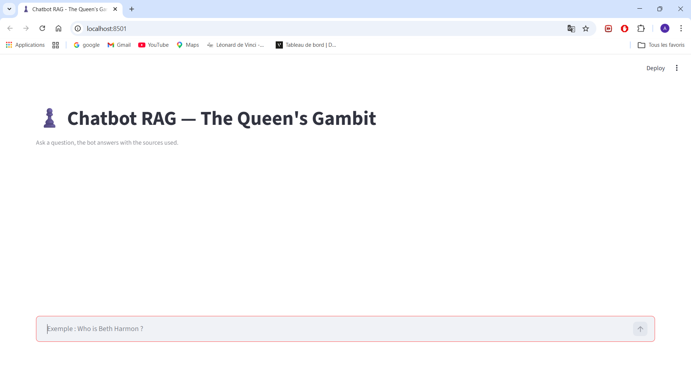
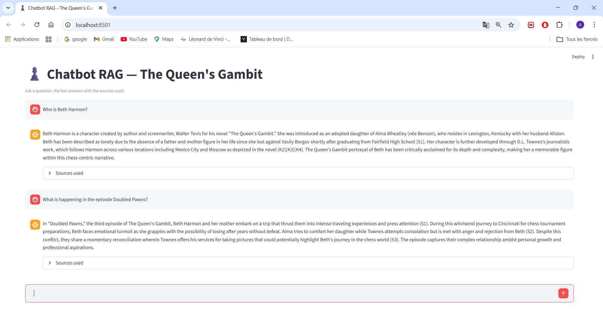
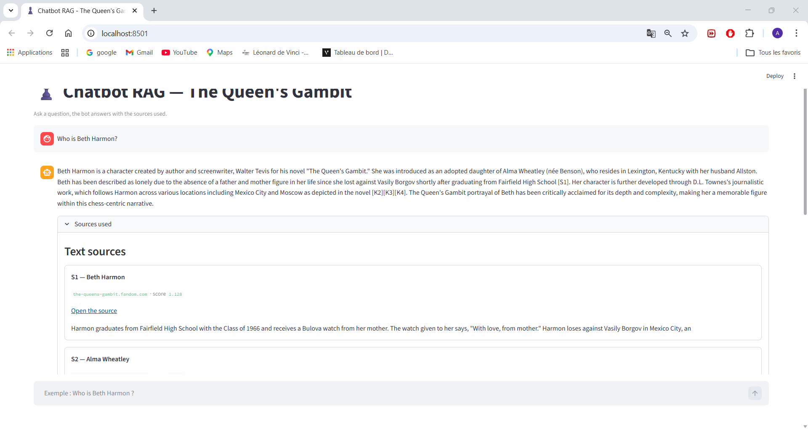
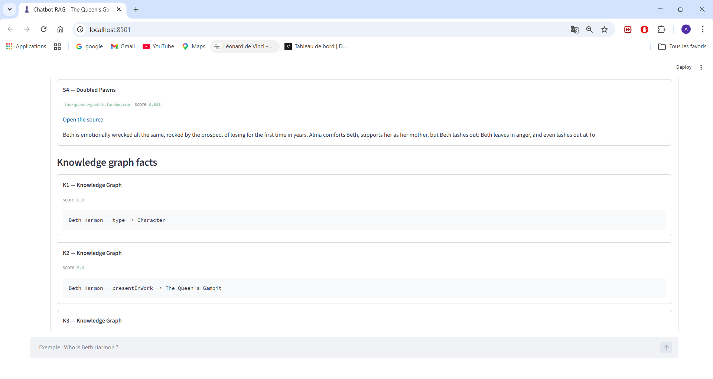

# ♟️ Chatbot RAG — The Queen's Gambit
### Antonin CHABAGNO / Guillaume CARLE — DIA 2

> A full **Knowledge Graph + RAG pipeline** applied to *The Queen's Gambit* universe.
> Crawling → NLP extraction → RDF/OWL graph → Wikidata alignment → SWRL reasoning → KGE → Hybrid RAG (text + graph)


---

## 📋 Table of Contents

1. [Project Overview](#project-overview)
2. [Architecture](#architecture)
3. [Key Results](#key-results)
4. [Project Structure](#project-structure)
5. [Installation](#installation)
6. [How to Run Each Module](#how-to-run-each-module)
   - [A. Crawling & Cleaning](#a-crawling--cleaning)
   - [B. NLP Extraction](#b-nlp-extraction)
   - [C. RDF Graph Construction](#c-rdf-graph-construction)
   - [D. Alignment & KB Expansion](#d-alignment--kb-expansion)
   - [E. SWRL Reasoning & KGE](#e-swrl-reasoning--kge)
   - [F. RAG Pipeline (CLI)](#f-rag-pipeline-cli)
   - [G. RAG with LLM](#g-rag-with-llm)
   - [H. Web App (Streamlit)](#h-web-app-streamlit)
7. [Running the RAG Demo](#running-the-rag-demo)
8. [Evaluation](#evaluation)
9. [Hardware Requirements](#hardware-requirements)
10. [Environment Variables](#environment-variables)

---

## Project Overview

This project implements a complete **semantic web and data mining pipeline** for *The Queen's Gambit* (novel & TV series). Starting from raw web crawls, it builds a structured Knowledge Graph, applies SWRL reasoning, trains Knowledge Graph Embedding (KGE) models, and deploys a **Hybrid RAG chatbot** that answers questions using both text chunks and structured KG facts.

**Key features:**
- 🕷️ Ethical web crawler targeting the Queen's Gambit Fandom wiki (BFS, robots.txt compliant)
- 🔬 Named Entity Recognition for character/relation extraction (238 entities, 21 relations)
- 🗂️ RDF/OWL 2 ontology (17 classes, 33 properties) with Wikidata entity alignment
- 🧠 SWRL reasoning: 4 rules inferring `hasRival` and `knownOpponent` relationships
- 🌐 Multi-hop Wikidata expansion: 665 → 25,231 triples (×37 enrichment)
- 📐 Three KGE models: TransE, DistMult, ComplEx (best: DistMult MRR 0.1986)
- 🔎 Hybrid retriever: dense vector search (FAISS) + KG facts + BM25 reranking
- 💬 LLM answer generation via Ollama (local, no paid API) with template fallback
- 🖥️ Streamlit web interface with inline source citations

---

## Architecture

```
Raw Web Pages
     │
     ▼
A. Crawl & Clean  ──►  data/raw_jsonl/pages.jsonl
     │
     ▼
B. NLP Extract    ──►  data/entities.csv  +  data/relations.csv
     │
     ▼
C. RDF Build      ──►  data/queens_gambit_graph_abox.ttl
     │                  data/ontologie_tbox.ttl
     ▼
D. Align & Expand ──►  data/predicate_alignment.ttl
                        data/entity_sameas_clean.ttl
                        data/expanded_kb.ttl  (25,231 triples, ×37)
     │
     ├──────────────────────────────────────────┐
     ▼                                          ▼
E. SWRL Reasoning                       E. KGE Training
   family.owl rules                       TransE / DistMult / ComplEx
   QG rules (hasRival,                    models/transe|distmult|complex
   knownOpponent)                         results/kge_metrics_comparison.csv
                                                │
                                                ▼
                                        F/G. RAG Pipeline
                                          Text chunks (FAISS)
                                          + KG facts (RDFLib / SPARQL)
                                          ──► LLM (Ollama phi3:mini)
                                          ──► Streamlit UI (port 8501)
```

---

## Key Results

| Metric | Value |
|--------|-------|
| Pages crawled | 50 (depth 2) |
| Entities extracted | 238 (8 classes) |
| Relations extracted | 21 (6 types, avg confidence 0.733) |
| OWL classes / properties | 17 / 33 |
| Predicate alignments (Wikidata) | 12 (3 equivalent + 9 subProperty) |
| SWRL rules applied | 4 (2 on family.owl + 2 on QG KB) |
| KG triples after expansion | 25,231 (×37 enrichment factor) |
| Unique entities in expanded KG | 9,218 |
| KGE best model — DistMult MRR | **0.1986** |
| KGE best model — Hits@10 | **0.4124** |
| RAG score vs. baseline | **14/15 vs. 12/15 (+2 pts)** |

---

## Project Structure

```
project-root/
│
├── src/
│   ├── A_01_crawl_clean.py               # Web crawler (BFS) + HTML cleaning
│   ├── B_02_nlp_extract.py               # NER + relation extraction (spaCy)
│   ├── C_03_clean_before_rdf.py          # Entity/relation CSV cleaning
│   ├── C_04_csv_to_rdf.py                # CSV → RDF/OWL (ABox + TBox)
│   ├── dedupe_entities.py                # Entity deduplication utility
│   ├── D_05_predicate_alignment.py       # Predicate alignment with Wikidata
│   ├── D_06_entity_linking.py            # Entity linking (Wikidata sameAs)
│   ├── D_07_filter_entity_linking.py     # Filter low-confidence links
│   ├── D_08_expand_kb.py                 # Multi-hop KB expansion (BFS)
│   ├── E 08b_swrl_reasoning.py           # SWRL reasoning (OWLReady2 + Pellet)
│   ├── E_09_prepare_triples.py           # KGE triple preparation
│   ├── E_10_clean_for_embedding.py       # Triple cleaning & dedup (OOV filter)
│   ├── E_11_split_dataset.py             # Train/valid/test split (83/8/8%)
│   ├── E_12_train_eval_visualize_kge.py  # Train KGE + metrics + t-SNE
│   ├── F_13_build_chunks.py              # Text chunking (JSONL, 220 words)
│   ├── F_14_build_vector_index.py        # FAISS index construction
│   ├── F_15_text_retriever.py            # Dense text retrieval
│   ├── F_16_kg_retriever.py              # KG fact retrieval (one-hop)
│   ├── F_16b_sparql.py                   # SPARQL-based KG retrieval
│   ├── F_17_hybrid_retriever_reranked.py # Hybrid retrieval + BM25 reranking
│   ├── F_18_generate_answer.py           # Template-based answer generation
│   ├── F_19_rag_cli.py                   # RAG CLI (no LLM — baseline)
│   ├── G_20_rag_cli_llm.py               # RAG CLI with LLM (Ollama)
│   ├── H_21_rag_service.py               # FastAPI backend service
│   ├── H_22_app_streamlit.py             # Streamlit web UI
│   └── Z_rag_evaluation.py               # RAG evaluation script
│
├── data/
│   ├── raw_jsonl/
│   │   ├── pages.jsonl                   # Crawled pages (cleaned text)
│   │   └── out_links.jsonl               # Extracted outgoing links
│   ├── entities.csv                      # Raw extracted entities
│   ├── entities_clean.csv                # Cleaned entities
│   ├── entities_dedup.csv                # Deduplicated entities (canonical)
│   ├── entity_aliases.csv                # Name alias mappings
│   ├── relations.csv                     # Raw extracted relations
│   ├── relations_clean.csv               # Cleaned relations
│   ├── entity_wikidata_mapping.csv       # Wikidata QID candidates
│   ├── entity_wikidata_mapping_clean.csv # Filtered high-confidence mappings
│   ├── entity_sameas.ttl                 # Raw owl:sameAs links
│   ├── entity_sameas_clean.ttl           # Filtered owl:sameAs links
│   ├── queens_gambit_graph_abox.ttl      # RDF ABox (~665 triples)
│   ├── ontologie_tbox.ttl                # OWL TBox (17 classes, 33 props)
│   ├── predicate_alignment.ttl           # Predicate Wikidata mappings
│   ├── expanded_kb.ttl                   # Final expanded KB (25,231 triples)
│   ├── family.owl                        # Family ontology for SWRL demo
│   ├── kg_triples.txt                    # Raw KGE input triples
│   ├── kg_clean.txt                      # Cleaned KGE triples (after OOV filter)
│   ├── train.txt                         # KGE training set  (20,184 triples)
│   ├── valid.txt                         # KGE validation set (2,008 triples)
│   ├── test.txt                          # KGE test set       (2,008 triples)
│   └── rag/
│       ├── chunks.jsonl                  # Text chunks (220 words, 50-word overlap)
│       ├── evaluation_results.json       # RAG evaluation results
│       ├── evidence_beth.json            # Cached evidence — Beth Harmon
│       ├── evidence_alice.json           # Cached evidence — Alice Harmon
│       ├── evidence_alma.json            # Cached evidence — Alma Wheatley
│       ├── evidence_doubled_pawns.json   # Cached evidence — Doubled Pawns episode
│       ├── evidence_qg.json              # Cached evidence — Queen's Gambit general
│       └── index/
│           ├── chunk_faiss.index         # FAISS vector index
│           ├── chunk_embeddings.npy      # Chunk embedding matrix
│           ├── chunk_metadata.json       # Chunk metadata (source, URL, score)
│           └── index_config.json         # Index configuration
│
├── models/
│   ├── transe/
│   │   ├── trained_model.pkl             # Trained TransE model
│   │   ├── metadata.json
│   │   ├── results.json
│   │   └── training_triples/             # entity_to_id, relation_to_id, etc.
│   ├── distmult/                         # DistMult model (best — MRR 0.1986)
│   │   ├── trained_model.pkl
│   │   ├── metadata.json
│   │   ├── results.json
│   │   └── training_triples/
│   └── complex/
│       ├── trained_model.pkl
│       ├── metadata.json
│       ├── results.json
│       └── training_triples/
│
├── results/
│   ├── kge_metrics_comparison.csv        # MRR, Hits@1/3/10 for all models
│   ├── transe_tsne.png                   # TransE t-SNE visualisation
│   ├── distmult_tsne.png                 # DistMult t-SNE visualisation
│   ├── complex_tsne.png                  # ComplEx t-SNE visualisation
│   ├── transe_nearest_neighbors.csv      # TransE KNN in embedding space
│   ├── distmult_nearest_neighbors.csv    # DistMult KNN in embedding space
│   ├── complex_nearest_neighbors.csv     # ComplEx KNN in embedding space
│   ├── transe_entity_embeddings.csv      # TransE entity vectors
│   ├── distmult_entity_embeddings.csv    # DistMult entity vectors
│   └── complex_entity_embeddings.csv     # ComplEx entity vectors
│
├── docs/
│   ├── front_page.png                    # Streamlit UI — empty state
│   ├── deux_question_.png                # Two-question demo with citations
│   ├── source_texte.png                  # Text sources panel screenshot
│   └── source_kg.png                     # KG facts panel screenshot
│
├── reports/
│   └── final_report.pdf                  # Final project report
│
├── .gitignore
├── requirements.txt
└── README.md
```

---

## Installation

### 1. Clone the repository

```bash
git clone https://github.com/<your-username>/Web-datamining-semantics-Project-GOT.git
cd Web-datamining-semantics-Project-GOT
```

### 2. Create the Conda environment

```bash
conda create -n semantic-web-data-mining-project python=3.12
conda activate semantic-web-data-mining-project
pip install -r requirements.txt
```

> **Note:** spaCy's transformer model must be downloaded separately:
> ```bash
> python -m spacy download en_core_web_trf
> ```

### 3. Install Ollama (for local LLM inference)

Download and install Ollama from [https://ollama.com](https://ollama.com), then pull the model used in all demos and evaluations:

```bash
ollama pull phi3:mini
```

Ollama must be running in the background before using the LLM-powered RAG pipeline:

```bash
ollama serve
```

### 4. Configure environment variables (optional)

```bash
cp .env.example .env
# Edit .env with your preferred editor
```

See [Environment Variables](#environment-variables) for available options.

---

## How to Run Each Module

The pipeline is designed to be executed **sequentially**. Each script produces artifacts consumed by the next stage. All scripts must be run from the **project root**.

---

### A. Crawling & Cleaning

Crawls the Queen's Gambit Fandom wiki using BFS (depth 2, max 50 pages), cleans HTML content with trafilatura, and outputs structured JSONL.

```bash
python src/A_01_crawl_clean.py
```

**Output:**
- `data/raw_jsonl/pages.jsonl` — cleaned page content
- `data/raw_jsonl/out_links.jsonl` — extracted outgoing links

---

### B. NLP Extraction

Runs Named Entity Recognition and relation extraction on crawled pages using spaCy `en_core_web_trf`. The `--report` flag prints extraction statistics.

```bash
python src/B_02_nlp_extract.py --report
```

**Output:** `data/entities.csv`, `data/relations.csv`

---

### C. RDF Graph Construction

Deduplicates entities, cleans CSV files, and converts them to RDF triples (ABox + TBox). Run in order:

```bash
python src/dedupe_entities.py
python src/C_03_clean_before_rdf.py
python src/C_04_csv_to_rdf.py
```

**Output:**
- `data/entities_dedup.csv`, `data/entities_clean.csv`, `data/relations_clean.csv`
- `data/queens_gambit_graph_abox.ttl` (~665 triples)
- `data/ontologie_tbox.ttl` (17 classes, 33 properties)

---

### D. Alignment & KB Expansion

Aligns predicates with Wikidata, links entities via `owl:sameAs`, filters low-confidence links, and expands the KB via multi-hop BFS over the Wikidata EntityData API.

```bash
python src/D_05_predicate_alignment.py
python src/D_06_entity_linking.py
python src/D_07_filter_entity_linking.py
python src/D_08_expand_kb.py
```

**Output:**
- `data/predicate_alignment.ttl` — 12 predicate mappings (3 equivalent + 9 subProperty)
- `data/entity_sameas_clean.ttl` — filtered high-confidence owl:sameAs links
- `data/expanded_kb.ttl` — 25,231 triples (×37 enrichment factor)

---

### E. SWRL Reasoning & KGE

#### E1 — SWRL Reasoning

Applies symbolic SWRL rules on `family.owl` and on the Queens Gambit KB using OWLReady2 + Pellet.

```bash
python "src/E 08b_swrl_reasoning.py"
```

> ⚠️ Note the space in the filename — quote the path when calling from the shell.

Rules applied:
- **family.owl:** `isUncleOf` (child + brother chain), `isGrandParentOf` (parent + parent chain)
- **Queens Gambit KB:** `hasRival` (mutual defeats), `knownOpponent` (met + defeated)

#### E2 — Knowledge Graph Embeddings

Prepares KGE datasets, trains three models (TransE, DistMult, ComplEx), evaluates them, and generates t-SNE visualisations and nearest-neighbour tables.

```bash
python src/E_09_prepare_triples.py
python src/E_10_clean_for_embedding.py
python src/E_11_split_dataset.py
python src/E_12_train_eval_visualize_kge.py
```

**Output:**
- `data/train.txt` (20,184 triples), `data/valid.txt` (2,008), `data/test.txt` (2,008)
- `models/transe/`, `models/distmult/`, `models/complex/` — trained models
- `results/kge_metrics_comparison.csv`, `results/*_tsne.png`, `results/*_nearest_neighbors.csv`

| Model | MRR | Hits@1 | Hits@3 | Hits@10 |
|-------|-----|--------|--------|---------|
| TransE | 0.1387 | 0.0369 | 0.1785 | 0.3314 |
| **DistMult ★** | **0.1986** | **0.0926** | **0.2371** | **0.4124** |
| ComplEx | 0.0074 | 0.0047 | 0.0055 | 0.0090 |

> DistMult achieves the best performance. ComplEx underperforms due to hyperparameter sensitivity — a grid search over learning rate and embedding dimension is recommended.

---

### F. RAG Pipeline (CLI)

Builds the text chunk index and runs the hybrid retriever without LLM (template baseline).

```bash
# Step 1 — Build chunks and FAISS index
python src/F_13_build_chunks.py
python src/F_14_build_vector_index.py

# Step 2 — Test individual retrievers
python src/F_15_text_retriever.py --question "Who is Beth Harmon?" --top_k 5
python src/F_16_kg_retriever.py --question "Who is Beth Harmon?"

# Step 3 — Hybrid retrieval + template answer generation
python src/F_17_hybrid_retriever_reranked.py \
    --question "Who is Beth Harmon?" \
    --output_json data/rag/evidence_beth.json

python src/F_18_generate_answer.py \
    --question "Who is Beth Harmon?" \
    --evidence_json data/rag/evidence_beth.json

# Step 4 — Full RAG CLI (baseline, no LLM)
python src/F_19_rag_cli.py --question "Who is Beth Harmon?" --mode debug
```

**Output:** `data/rag/chunks.jsonl`, `data/rag/index/`, `data/rag/evidence_*.json`

---

### G. RAG with LLM

Generates answers using the local Ollama model (phi3:mini), with automatic fallback to templates if Ollama is unavailable. Use `--use_sparql` to activate the SPARQL-based KG retrieval module (F_16b_sparql.py).

```bash
# Standard mode
python src/G_20_rag_cli_llm.py \
    --question "Who is Beth Harmon?" \
    --provider ollama \
    --model phi3:mini \
    --mode simple

# Debug mode (shows full retrieved evidence)
python src/G_20_rag_cli_llm.py \
    --question "What is happening in the episode Doubled Pawns?" \
    --provider ollama \
    --model phi3:mini \
    --mode debug

# SPARQL-based KG retrieval (structured query mode)
python src/G_20_rag_cli_llm.py \
    --question "Who portrays Beth Harmon?" \
    --use_sparql \
    --provider ollama \
    --model phi3:mini \
    --mode simple
```

**Key CLI arguments:**

| Argument | Default | Description |
|----------|---------|-------------|
| `--question` | *(required)* | Single question to answer |
| `--interactive` | off | Interactive Q&A loop |
| `--mode` | `simple` | Output mode: `simple` or `debug` |
| `--answer_mode` | `normal` | `short` (2–4 sentences) or `normal` (4–6) |
| `--use_sparql` | off | Use F_16b_sparql.py instead of default KG traversal |
| `--provider` | `ollama` | LLM provider: `ollama` or `template` |
| `--model` | `phi3:mini` | Ollama model name |
| `--show_sources` | off | Display ranked sources after the answer |
| `--kg` | `data/expanded_kb.ttl` | Path to knowledge graph TTL file |

---

### H. Web App (Streamlit)

Launches the full interactive chatbot with source citations. Requires Ollama to be running.

```bash
streamlit run src/H_22_app_streamlit.py
```

Then open [http://localhost:8501](http://localhost:8501) in your browser.

---

## Running the RAG Demo

> **Prerequisites:** all pipeline steps A through F must have been run at least once to generate the index and evidence files. Ollama must be running (`ollama serve`).

```bash
# 1. Start Ollama in background
ollama serve &

# 2. Run the LLM-powered RAG CLI
python src/G_20_rag_cli_llm.py \
    --question "Who is Beth Harmon?" \
    --provider ollama --model phi3:mini --mode simple

# 3. Or launch the full web UI
streamlit run src/H_22_app_streamlit.py
```

**Example questions to try:**

| Question | Expected behaviour |
|----------|--------------------|
| `Who is Beth Harmon?` | Character description with KG + text sources |
| `Who is William Shaibel?` | Minor character with mentor role |
| `What is happening in the episode Doubled Pawns?` | Episode summary from text chunks |
| `What chess tournaments did Beth Harmon win?` | KG-grounded factual answer |
| `Who portrays Beth Harmon in the Netflix series?` | Casting from KG sameAs links |
| `What is the queen's gambit?` | Chess opening explanation |

### Screenshots

**Front page — empty state**



**Two questions answered with source citations**



**Text sources panel — ranked passages with scores**



**Knowledge graph facts panel — structured triples**



---

## Evaluation

Run the full RAG evaluation over 5 predefined questions, comparing the template baseline against the full RAG pipeline:

```bash
python src/Z_rag_evaluation.py --model phi3:mini --out data/rag/evaluation_results.json
```

**Results:**

| ID | Category | Question | Baseline | RAG |
|----|----------|----------|----------|-----|
| Q1 | Character identity | Who is Beth Harmon? | 3/3 | 3/3 |
| Q2 | Character identity | Who is William Shaibel? | 2/3 | 3/3 |
| Q3 | Factual / KG | What tournaments did Beth win? | 1/3 | 2/3 |
| Q4 | Episode summary | What is happening in Doubled Pawns? | 3/3 | 3/3 |
| Q5 | Real-world / casting | Who portrays Beth Harmon? | 3/3 | 3/3 |
| **Total** | | | **12/15** | **14/15** |

Scoring rubric: `0/3` = wrong/hallucinated · `1/3` = partial · `2/3` = mostly correct · `3/3` = complete & precise

Full results are saved to `data/rag/evaluation_results.json`.

---

## Hardware Requirements

| Component | Minimum | Recommended |
|-----------|---------|-------------|
| RAM | 8 GB | 16 GB |
| Disk space | 5 GB | 10 GB |
| CPU | 4 cores | 8 cores |
| GPU | Not required | Optional (speeds up KGE training) |
| OS | Windows 10 / macOS / Linux | Ubuntu 22.04 / macOS 14 |

> KGE training (TransE / DistMult / ComplEx) runs on CPU but may take 10–30 minutes depending on dataset size. GPU acceleration is supported via PyKEEN if CUDA is available.

---

## Environment Variables

Create a `.env` file at the project root (copy from `.env.example` if available):

```env
# Optional — only needed if using OpenAI or Anthropic as LLM provider
ANTHROPIC_API_KEY=your_key_here
OPENAI_API_KEY=your_key_here

# Ollama host (default: http://localhost:11434)
OLLAMA_HOST=http://localhost:11434
```

---

## License

This project is for academic purposes. All crawled data is sourced from publicly available wiki pages under their respective licenses.
